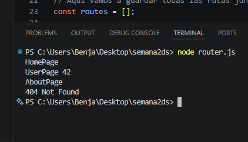
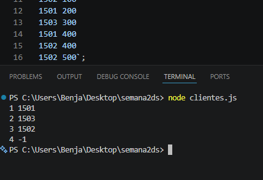

# Ejercicio 1: Router SPA

En este ejercicio simularé cómo funcionan los sistemas de rutas en el frontend, como los que usan frameworks tipo React o Vue. La idea es que, dependiendo de la URL que el usuario ingrese, el programa decide qué contenido mostrar sin recargar toda la aplicación. El programa va a recibir un conjunto de rutas válidas junto con su contenido, y luego evalúa varias URLs para ver cuál coincide.

## Funcionamiento:

Primero se leen todas las rutas y se guardan en memoria. Cada ruta tiene un *path* (por ejemplo `/user/:id`) y un contenido asociado (por ejemplo `UserPage`). Estas rutas se separan por partes usando el símbolo `/`, lo que permite compararlas más fácilmente después.  
Luego, por cada URL que el usuario intenta visitar, se hace el mismo proceso: se divide en partes para poder compararla con las rutas guardadas.  
Después entra la parte más importante, que es la comparación. El programa revisa cada ruta y compara segmento por segmento:

- Si la cantidad de partes no coincide, la ruta se descarta de inmediato.  
- Si el segmento es texto normal, debe ser exactamente igual.  
- Si el segmento empieza con `:`, se considera un parámetro, entonces acepta cualquier valor y lo guarda.  

Por ejemplo, si la ruta es `/user/:id` y la URL es `/user/42`, el programa detecta que `42` es el valor del parámetro y lo guarda.

Finalmente, si encuentra una coincidencia, muestra el contenido de la ruta. Si había parámetros, los agrega al final del texto. Si no encuentra ninguna coincidencia, devuelve un error 404.

## Resultado obtenido

Al ejecutar el programa con los datos de prueba, se obtiene:

---

# Ejercicio 2: Cliente más fiel por socio

En este ejercicio se trabaja con un problema donde varios socios tienen distintos terminales, y a través de esos terminales los clientes realizan compras. El objetivo es identificar cuál es el cliente más fiel de cada socio, es decir, el que realizó más compras usando sus terminales.

El programa recibe información de los socios, los terminales que pertenecen a cada uno y las transacciones realizadas por los clientes. A partir de eso, se debe analizar quién compró más veces en cada socio.

## Funcionamiento:

Primero se relacionan los terminales con su respectivo socio. Esto permite saber rápidamente a qué socio pertenece cada compra que se realiza.

Luego, se recorren todas las transacciones. En cada una se identifica el cliente y el terminal que utilizó. Con esa información, se incrementa un contador que lleva el número de compras que hizo cada cliente en cada socio.

Después de procesar todas las transacciones, se revisa cada socio por separado. Para cada uno, se busca el cliente que tenga la mayor cantidad de compras registradas.

- Si un cliente tiene más compras que los demás, se convierte en el más fiel.  
- Si hay empate entre varios clientes, se elige el que tenga el ID más pequeño.  
- Si un socio no tiene ninguna compra registrada, se muestra -1.  

Finalmente, se imprime el resultado mostrando el ID del socio junto con el ID de su cliente más fiel.

## Resultado obtenido

Al ejecutar el programa con los datos de prueba, se obtiene:

